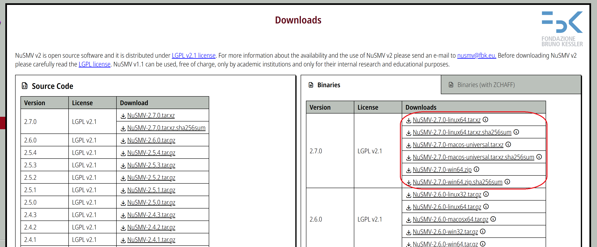
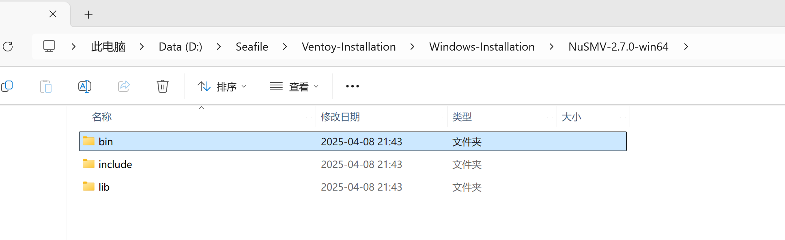
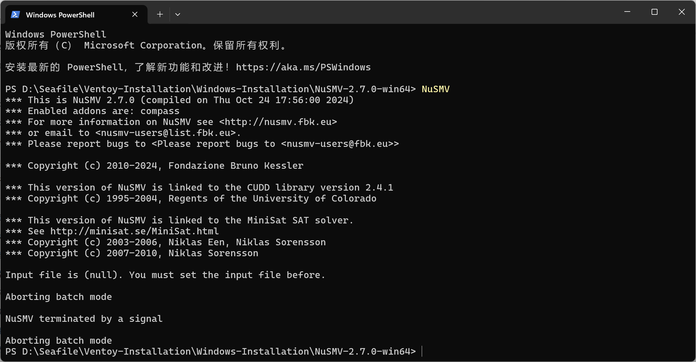
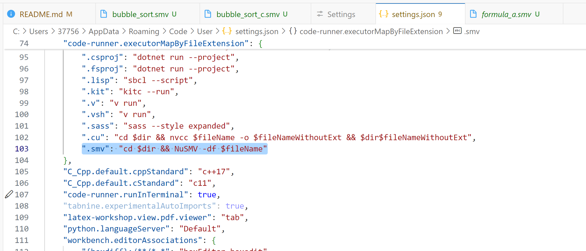

# NuSMV-Project-01

本仓库是《软件工程理论基础》项目一代码和报告。

【广告】除了 NuSMV 之外，软件工程有另一个形式化验证工具 [TLA+](https://lamport.azurewebsites.net/tla/tla.html?from=https://research.microsoft.com/users/lamport/tla/tla.html&type=path)。该工具由图灵奖获得者 [Leslie Lamport](https://lamport.azurewebsites.net/) 开发（$\LaTeX$ 中的 La 就是指 Lamport）。我的 b 站主页搬运了 Lamport 本人录制的教程 [The TLA+ Video Course](https://www.bilibili.com/video/BV1JG4y1Y7tj/?spm_id_from=333.1387.0.0)，仅供学习。

## NuSMV 的安装和配置

在 [NuSMV - Downloads](https://nusmv.fbk.eu/downloads.html) 下载对应版本，推荐直接下载右侧红框中对应的二进制文件。



以 Windows 系统为例，下载到本地后解压到任意目录。



将 `NuSMV-2.7.0-win64/bin` 的路径添加到系统环境变量后，即可在命令行使用 NuSMV 命令。



使用下列命令可以运行所需的 NuSMV 源文件。

```bash
NuSMV -df filename.smv
```

在 VSCode 中安装 coderunner 插件，并在配置文件中添加 `".smv": "cd $dir && NuSMV -df $fileName"` 即可使用快捷键 `Ctrl+Alt+N` 运行 `.smv` 文件。



## 等价性判断

结论：a 和 d 中两个公式不等价，b 和 c 中两个公式等价。

`./formula/fomula_a.smv` 给出了 a 的一个反例；`./formula/fomula_d.smv` 给出了 d 的一个反例。

## 冒泡排序建模

`./bubble_sort/bubble_sort.smv` 使用 SMV 代码建模冒泡排序算法，并验证是否完成排序。

基本思路是，根据 `j` 的取值来实现交换逻辑，例如下面代码片段。值得注意，NuSMV 是同步赋值，因此 `a0` 和 `a1` 的更新基于当前状态的值，下面写法中的变量交换是原子的。

```smv
  -- 交换逻辑
  next(a0) := case
    -- 比较 a[j] 和 a[j+1]，若需要交换则更新
    j = 0 & a0 > a1 : a1;  -- 交换 a0 和 a1
    TRUE : a0;
  esac;

  next(a1) := case
    j = 0 & a0 > a1 : a0;  -- 交换 a0 和 a1
    j = 1 & a1 > a2 : a2;  -- 交换 a1 和 a2
    TRUE : a1;
  esac;

  next(a2) := case
    j = 1 & a1 > a2 : a1;  -- 交换 a1 和 a2
    TRUE : a2;
  esac;
```

`./bubble_sort/bubble_sort_c.smv` 是改进的算法，使用枚举避免整数域运算，并验证了算法的正确性。由于题目限制了变量的取值范围为 `0..7`，因此可以用三个比特（布尔值）来表达一个整数，进而用布尔（逻辑）运算来代替整数运算。

```smv
DEFINE
  -- 定义比较逻辑（使用位比较代替数值比较）
  greater_a0_a1 := (a0_b2 & !a1_b2) | 
                   ((a0_b2 = a1_b2) & (a0_b1 & !a1_b1)) | 
                   ((a0_b2 = a1_b2) & (a0_b1 = a1_b1) & (a0_b0 & !a1_b0));

  greater_a1_a2 := (a1_b2 & !a2_b2) | 
                   ((a1_b2 = a2_b2) & (a1_b1 & !a2_b1)) | 
                   ((a1_b2 = a2_b2) & (a1_b1 = a2_b1) & (a1_b0 & !a2_b0));
```

## Raft 算法建模

`./raft/raft.smv` 使用 NuSMV 对 Raft 算法进行建模，并验证了其正确性。